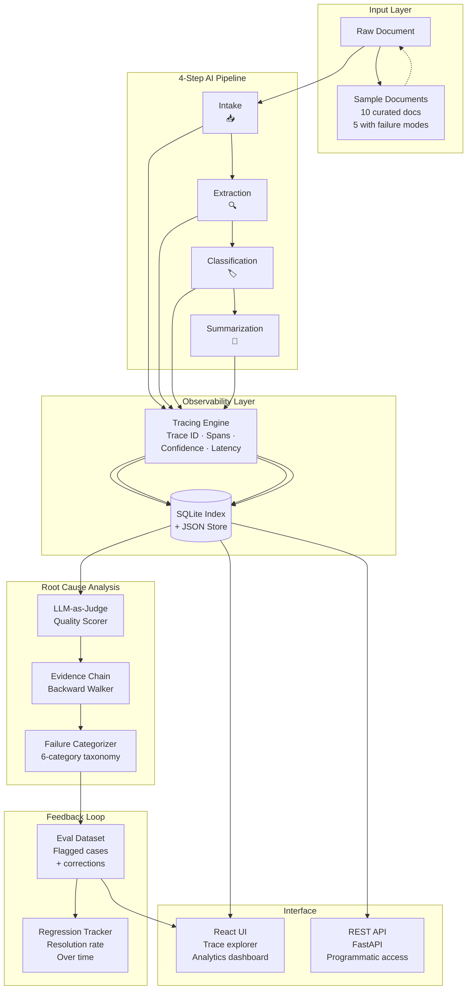
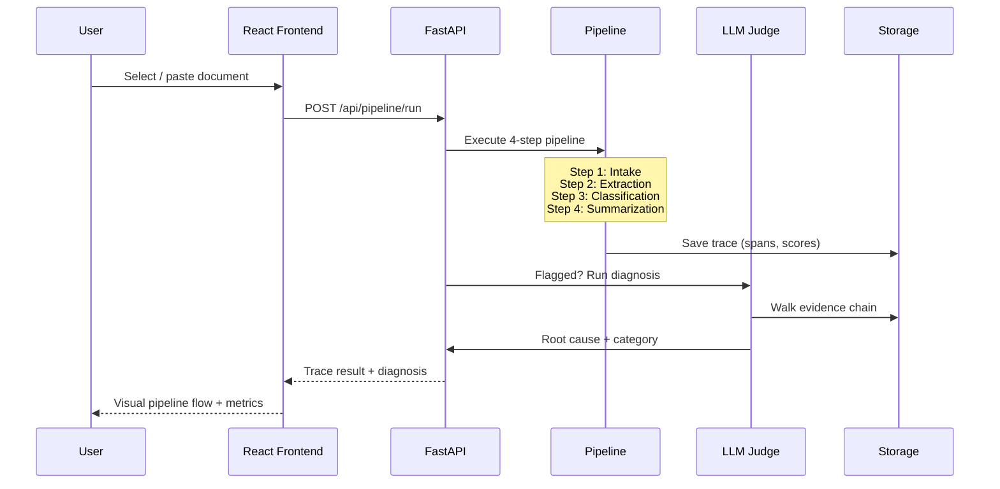
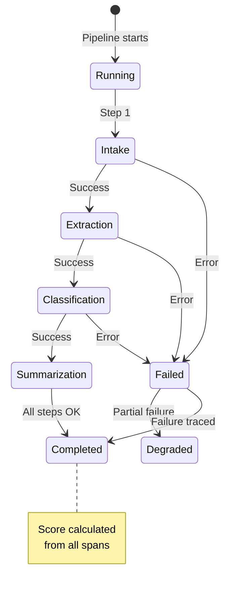
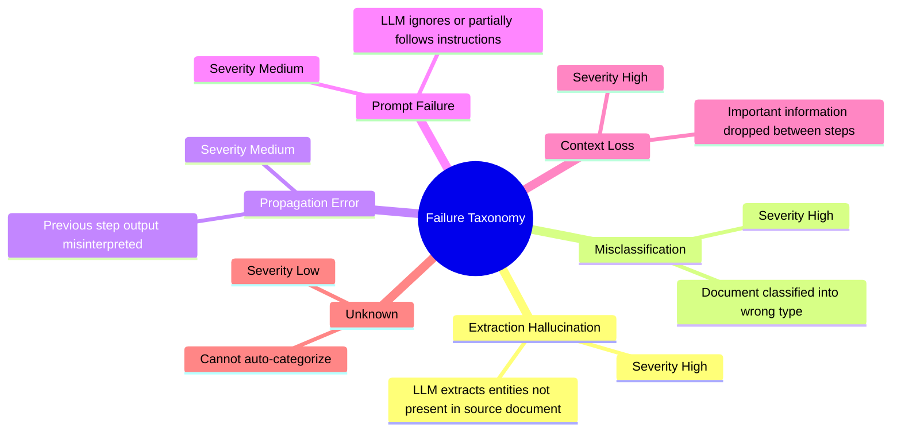

# ⛓️ Failure Forensics — AI Pipeline Observability

<p align="center">
  
  
  
  
  
</p>

<p align="center">
  <b>Trace · Diagnose · Improve</b> — An observability layer for multi-step AI pipelines that traces every intermediate step, pinpoints root causes of failures, and builds a growing evaluation dataset through continuous feedback.
</p>

---

## 📋 Table of Contents

- [System Architecture](#system-architecture)
- [How It Works](#how-it-works)
- [Failure Taxonomy](#-failure-taxonomy)
- [Tech Stack](#-tech-stack)
- [Quick Start](#quick-start)
- [API Reference](#api-reference)
- [Project Structure](#project-structure)
- [Use Case: Placement Demo](#use-case-placement-demo)

---

## System Architecture



---

## How It Works

### Pipeline Execution Flow



### Tracing & Span Lifecycle



## Data Flow

```mermaid
flowchart LR
    subgraph PerStep["Per-Step Span Data"]
        S1[Step Name] --> S2[Input/Output]
        S2 --> S3[Confidence 0-1]
        S3 --> S4[Token Count]
        S4 --> S5[Latency ms]
        S5 --> S6[Error / Status]
    end

    subgraph Trace["Trace Object"]
        T1[Trace ID] --> T2[Timestamp]
        T2 --> T3[Source Label]
        T3 --> T4[Final Score]
        T4 --> T5[Status]
        T5 --> T6[Diagnosis]
        T6 --> T7["Spans Array"]
    end

    subgraph Storage["Storage Backend"]
        DB[(SQLite Index)] --> J[(JSON Files)]
    end

    PerStep --> Trace
    Trace --> Storage

    style S1 fill:#1A1F3D,stroke:#6366F1
    style T1 fill:#1A1F3D,stroke:#6366F1
    style DB fill:#131839,stroke:#F59E0B
```



---

## 🏷️ Failure Taxonomy

Every flagged failure is classified into one of six categories:


## 🛠️ Tech Stack

| Layer | Technology | Purpose |
|-------|-----------|---------|
| **Backend** | Python 3.11+ | Core logic |
| **Framework** | FastAPI | REST API server |
| **AI** | Google Gemini (`google-generativeai`) | LLM-powered steps + judge |
| **Frontend** | React 18 + Vite | Interactive UI |
| **Storage** | SQLite + JSON files | Trace index + span data |
| **Container** | Docker | Deployment |
| **Styling** | Pure CSS (custom design system) | Dark theme UI |

---

## Quick Start

### Prerequisites

- Python 3.11+
- Node.js 18+ (for frontend development)
- Google Gemini API key ([get one free](https://aistudio.google.com/apikey))

### 1. Clone & Setup

```bash
git clone <your-repo-url>
cd ai-failure-forensics

# Python dependencies
pip install -r requirements.txt

# Frontend dependencies (optional — pre-built dist included)
cd ui/frontend && npm install && cd ../..
```

### 2. Configure API Key

```bash
cp .env.example .env
# Edit .env and set your GEMINI_API_KEY
```

### 3. Run

**Production (single command — serves both API + Frontend):**

```bash
python -m uvicorn feedback.api:app --host 0.0.0.0 --port 8000
```

Open **http://localhost:8000** in your browser.

**Development (hot-reload frontend):**

```bash
# Terminal 1: FastAPI backend
python -m uvicorn feedback.api:app --host 0.0.0.0 --port 8000 --reload

# Terminal 2: Vite dev server
cd ui/frontend && npm run dev
```

Open **http://localhost:5173** — Vite proxies `/api` calls to FastAPI.

### 4. Batch Process Demo Data

```bash
# Via API
curl -X POST http://localhost:8000/api/pipeline/batch-run \
  -H "Content-Type: application/json" \
  -d '{  "documents": [  {    "id": "demo-1",    "source": "demo",    "text": "Sample document text here..."  }]}'

# Or trigger from the UI → Run Pipeline tab → Batch Processing
```

### Docker

```bash
docker-compose up
```

---

## API Reference

All endpoints are prefixed with `/api`:

| Method | Endpoint | Description |
|--------|----------|-------------|
| `GET` | `/api/health` | Health check |
| `GET` | `/api/traces?limit=100` | List all traces |
| `GET` | `/api/traces/{trace_id}` | Get full trace with spans |
| `POST` | `/api/traces/{trace_id}/flag` | Flag bad output + auto-diagnose |
| `POST` | `/api/traces/{trace_id}/override-diagnosis` | Override AI diagnosis |
| `GET` | `/api/analytics` | Failure analytics & metrics |
| `GET` | `/api/eval-cases` | List evaluation dataset |
| `GET` | `/api/sample-documents` | Get 10 sample documents |
| `GET` | `/api/failure-types` | List failure taxonomy |
| `POST` | `/api/pipeline/run` | Execute pipeline on text |
| `POST` | `/api/pipeline/batch-run` | Batch process documents |

### Interactive API Docs

Once running, visit **http://localhost:8000/docs** for Swagger UI.

---

## 📁 Project Structure

```
ai-failure-forensics/
├── pipeline/                  # AI Pipeline
│   ├── models.py             # Pydantic models (Document, Entities, Classification, etc.)
│   ├── llm_client.py         # Gemini API wrapper (retry, truncation, JSON mode)
│   ├── steps.py              # 4 pipeline step implementations
│   └── pipeline.py           # Pipeline orchestrator
├── tracing/                   # Observability Layer
│   ├── trace.py              # Trace & Span data structures
│   ├── decorators.py         # Step instrumentation decorator
│   └── storage.py            # SQLite index + JSON file persistence
├── analyzer/                  # Root Cause Analysis
│   ├── judge.py              # LLM-as-judge quality scorer
│   └── taxonomy.py           # 6-category failure classification
├── feedback/                  # Feedback Loop
│   ├── api.py                # FastAPI REST server (all endpoints)
│   ├── eval_dataset.py       # Growing eval dataset (JSONL)
│   └── analytics.py          # Failure analytics engine
├── data/                      # Data & Samples
│   ├── sample_documents.py   # 10 curated documents (5 with failure modes)
│   └── __init__.py
├── ui/frontend/              # React + Vite Frontend
│   ├── src/
│   │   ├── App.jsx           # Main app (4-tab layout)
│   │   ├── App.css           # Custom design system (dark theme)
│   │   ├── api.js            # API client
│   │   ├── icons.jsx         # 16 SVG icon components
│   │   └── components/
│   │       ├── TracesTab.jsx       # List + search traces
│   │       ├── TraceDetail.jsx     # Full trace inspection
│   │       ├── AnalyticsTab.jsx    # Metrics dashboard
│   │       ├── PipelineRunner.jsx  # Run pipeline UI
│   │       └── PipelineFlow.jsx    # Animated pipeline viz
│   ├── dist/                  # Built production files
│   ├── package.json
│   └── vite.config.js
├── main.py                    # CLI entry point
├── requirements.txt           # Python dependencies
├── Dockerfile                 # Container build
├── docker-compose.yml         # Multi-service setup
└── .env.example               # Environment template
```

---

## 🧪 Use Case: Placement Demo

This project demonstrates engineering maturity across multiple dimensions:

### Demonstrated Skills

| Area | Evidence |
|------|----------|
| **System Design** | Multi-layer architecture (pipeline → tracing → analysis → feedback) |
| **LLM Engineering** | Structured JSON prompts, retry logic, truncation, model abstraction |
| **Full-Stack Development** | React frontend + FastAPI backend + SQLite/JSON persistence |
| **Observability** | Distributed tracing with spans, latency tracking, confidence scoring |
| **ML/Evaluation** | LLM-as-judge, growing eval dataset, regression tracking |
| **Error Handling** | Graceful degradation, per-step isolation, cascade failure prevention |
| **UI/UX Design** | Custom design system, dark theme, animated pipeline flow, SVG icons |
| **DevOps** | Docker containerization, environment configuration, CI-ready |

### Sample Scenario Walkthrough

```
1. Start the server                        → python -m uvicorn feedback.api:app
2. Open the UI                             → http://localhost:8000
3. Go to Run Pipeline tab
4. Select "correspondence-contradictory"   → A memo with conflicting clauses
5. Click "Run Pipeline"                    → Pipeline executes 4 steps
6. Observe degraded/failure status         → Score drops at problematic step
7. Switch to Traces tab                    → Find the new trace
8. Click Inspect                           → See pipeline flow visualization
9. Click "Flag as Bad Output"              → LLM judge auto-diagnoses
10. View root cause + evidence chain       → Diagnosis with confidence
11. Check Analytics tab                    → Eval cases growing
```

---

## 📄 License

MIT License — see [LICENSE](LICENSE) for details.

---

<p align="center">
  Built with ❤️ for reliable AI pipelines
</p>
